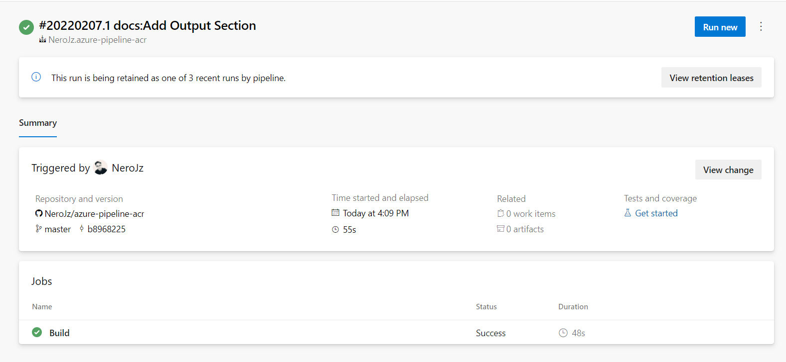
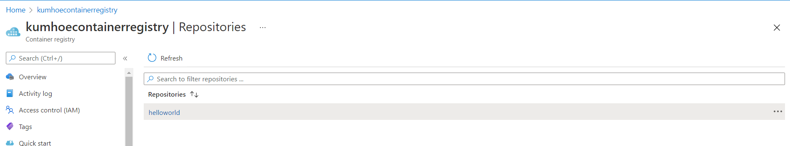

# azure-pipeline-acr
Build a Docker Image Using Azure Pipeline

## Description
This project showcase how to build a Docker Image node application using Azure Pipeline and upload the image
to the Azure Container Registry (ACN)

## Getting Started
1. Install [Docker Desktop 3](https://docs.docker.com/desktop/windows/release-notes/3.x/)
2. Install NodeJS
3. Create an Azure Free Account
3. Create an account from [Azure Devops](https://go.microsoft.com/fwlink/?LinkId=307137)

## Instruction
1. Fork the repository
2. Configure the Azure DevOps Project. Refer the official [docs](https://docs.microsoft.com/en-us/azure/devops/pipelines/ecosystems/containers/acr-template?view=azure-devops&viewFallbackFrom=tfs-2018)

## Expected Result
Once the Azure Pipeline was successfully configured, any changes/update on the Master branch will trigger the build process of Azure Pipeline.

The image will also upload to the container registry after job was successfully run.

